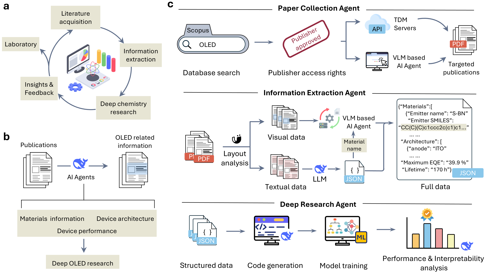

# A Closed-Loop Multiagent Framework for Automated Material Data Mining

This is the repository for the paper "A Closed-Loop Multiagent Framework for Automated Material Data Mining".




## Overview

The repository contains the code for the OLED Agent, a multiagent framework for automated material data mining. The framework consists of three main components:

- 📚 Paper Collection Agent: An agent that collects papers from a given topic.
- 📝 Information Extraction Agent: An agent that extracts information from a given paper.
- 🧠 Deep Researcher Agent: An agent that automatically models the relationship between device performance and device design parameters.

## Installation

```bash
conda create --name new_env --file requirements.txt
conda activate new_env

```

### Paper Collection Agent
For the paper collection agent, you need to install the following tools on your local machine:

- noVNC
- OmniParser


## Web Interface

We suggest using the web interface to interact with the OLED Agent like [oled-v1.streamlit.app](https://oled-v1.streamlit.app/).

```bash
cd web
streamlit run app.py
```

## Demo
<video src="assets/video-720.mp4" controls width="640"></video>
<video src="assets/video2-720.mp4" controls width="640"></video>


